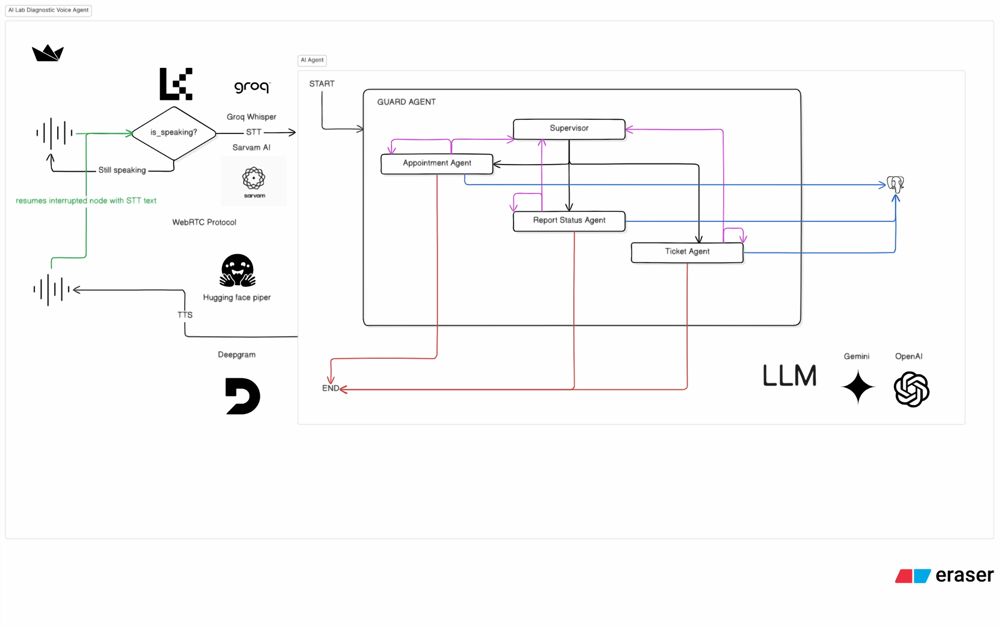
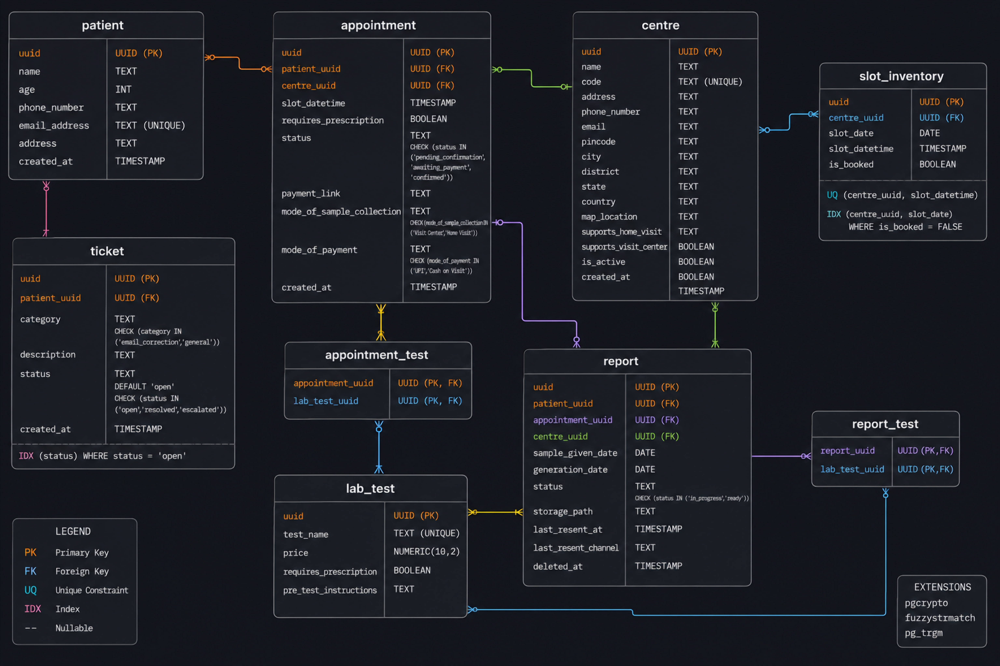

# Lab Diagnostic Voice AI Agent


Voice agent for lab diagnostics. Handles appointment booking, report status checks and basic support tickets over a phone call (LiveKit + SIP).

### Architecture



Caller → LiveKit (SIP/WebRTC) → Python worker (STT Groq Whisper / LLM Gemini / TTS Piper) → PostgreSQL.

Supervisor agent routes to three specialists: Appointment, Report Status, Ticket.

### Database schema



Tables: centre, lab_test, patient, slot_inventory, appointment, appointment_test, report, report_test, ticket. Migrations are under `app/db/migrations/`.

### Demo

[Demo video](docs/demo.mp4) *(coming soon)*

### What works today
- Multi-agent handoff (supervisor → specialists)
- Slot booking with home-visit / visit-centre modes
- Identity check (name + age + last-4 phone digits)
- Report lookup + resend
- Support ticket creation
- Fuzzy name / city matching for STT errors
- Health endpoints and structured JSON logs

### Known gaps (honest)
- No load testing has been done yet.
- Metrics are collected from LiveKit sessions but are only written to logs, nothing is wired to Prometheus, Grafana or any alerting system.
- App worker and Streamlit demo still run on the host; only Postgres + LiveKit are in docker-compose.
- STT (Whisper via Groq) still struggles with some Indian names; spell-back confirmation is the current mitigation.

### Quick start

```bash
cp .env.example .env          # fill in keys
docker compose up -d          # Postgres + LiveKit only
alembic -c app/db/alembic.ini upgrade head
# load data using reference tests/db/scripts/mock_data.sql
docker compose exec -T postgres psql -U <DB_USERNAME> -d <DB_NAME> < tests/db/scripts/mock_data.sql
python main.py                # agent worker
streamlit run streamlit_app.py   # optional web demo